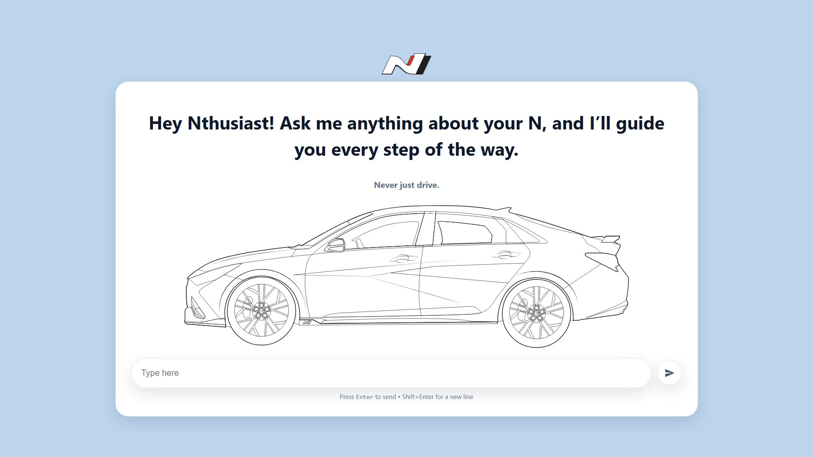
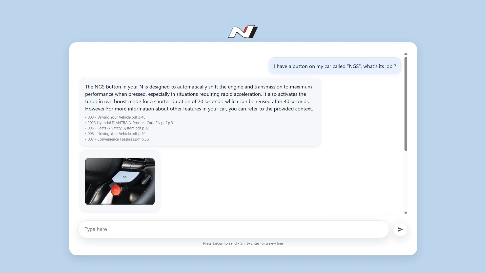
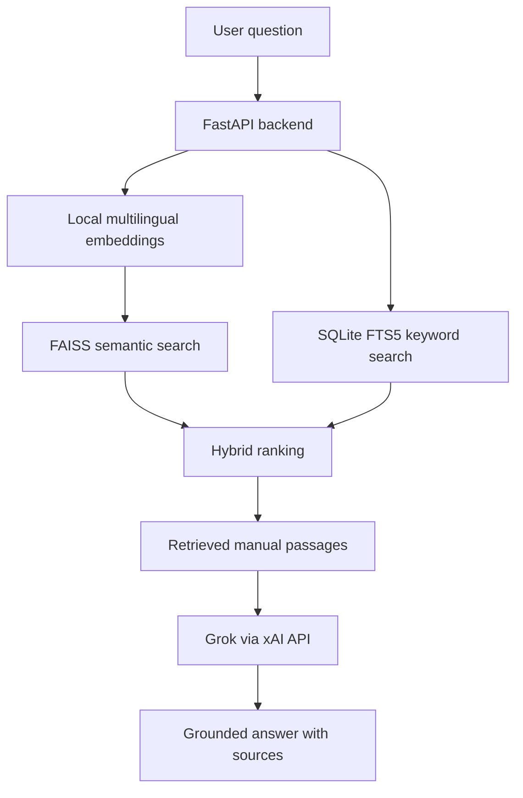

# Customizable Vehicle Manual RAG Assistant

**A customizable RAG assistant for vehicle manuals, powered by Grok.** Configure it for your own vehicle by setting the vehicle name and indexing its manuals or reference documents.

Ask questions in natural language and get answers grounded in retrieved manual passages, with file and page references.





> Independent project; not affiliated with or endorsed by any vehicle manufacturer. This is a document lookup assistant, not a diagnostic tool. Always verify maintenance and safety instructions in the official documentation for your vehicle.

## Customize it for your vehicle

This app runs one vehicle profile and one document collection at a time. To configure it for your vehicle:

1. Copy `.env.example` to `.env`.
2. Set `VEHICLE_NAME` to the make, model, and year you want displayed.
3. Put your authorized vehicle manuals or reference PDFs in `data/pdfs/`.
4. Rebuild the local knowledge base with `python scripts/build_index.py`.
5. Start the app and ask questions through the chat interface.

Example:

```env
VEHICLE_NAME=2023 Hyundai Elantra N
```

If you change vehicles, replace the PDFs in `data/pdfs/` and rebuild the index so the answers and the configured vehicle profile stay aligned.

The repository does not include vehicle manuals, extracted text, vector indexes, databases, or API keys. Provide your own authorized manuals locally to populate the knowledge base.

## What it does

- Indexes user-provided PDF manuals and vehicle reference documents.
- Retrieves relevant passages using multilingual semantic search and BM25 keyword search.
- Uses Grok to generate grounded answers from the retrieved excerpts.
- Returns source references with file names, page ranges, and excerpts.
- Supports English and Arabic questions through a multilingual embedding model.
- Provides a responsive chat interface and JSON API through FastAPI.

## Architecture



## How retrieval works

`scripts/build_index.py` reads PDFs from `data/pdfs/`, extracts text with PyMuPDF, and creates overlapping text chunks while preserving source metadata such as file name and page range.

The app stores:

- Text chunks and metadata in SQLite FTS5.
- Vector embeddings in a FAISS index.
- Local generated files under `data/generated/`.

For each question, the backend combines:

- Semantic search using `intfloat/multilingual-e5-base`.
- Keyword search using SQLite FTS5 / BM25.
- Weighted rank fusion to select the strongest passages.

Grok receives the selected excerpts, the configured vehicle name, and grounding instructions. It must answer from the provided sources and cite source labels such as `[S1]`.

## Grok and data handling

Grok is called from the backend, so the API key is never exposed in browser code.

The app sends the user question and retrieved excerpts to xAI for inference. Requests use the xAI Responses API with `store=False`, and the app does not persist chat history.

## Run locally on Windows

### Requirements

- Python 3.11
- An xAI API key
- PDF manuals or reference documents you are authorized to process

### Install dependencies

From PowerShell inside the project directory:

```powershell
py -3.11 -m venv .venv
.\.venv\Scripts\Activate.ps1
python -m pip install --upgrade pip
pip install -r requirements.txt
```

### Configure environment variables

Create your local `.env` file:

```powershell
Copy-Item .env.example .env
notepad .env
```

Set your values:

```env
XAI_API_KEY=your_xai_api_key_here
VEHICLE_NAME=Your Vehicle Name
```

Keep `.env` private. It is excluded from Git by `.gitignore`.

### Add PDFs and build the knowledge base

Create the PDF folder if needed:

```powershell
mkdir data\pdfs
```

Copy your authorized PDF manuals into:

```text
data/pdfs/
```

Build the local knowledge base:

```powershell
python scripts/build_index.py
```

The generated SQLite database and FAISS index are written under:

```text
data/generated/
```

These generated files are excluded from Git.

### Start the app

```powershell
uvicorn app.main:app --host 127.0.0.1 --port 8000
```

Open:

```text
http://127.0.0.1:8000
```

API documentation:

```text
http://127.0.0.1:8000/docs
```

## API

### Ask a question

`POST /api/ask`

```json
{
  "question": "How do I check the engine oil?"
}
```

The response includes:

- `answer`
- `sources`
- file names
- page ranges
- excerpts
- timing information

### Health check

`GET /api/health`

Returns knowledge base status, model names, and the configured vehicle name.

## Repository layout

```text
app/
  config.py          Environment settings, including VEHICLE_NAME
  embeddings.py      Multilingual E5 encoder
  grok.py            xAI Responses API client and grounded prompt
  main.py            FastAPI endpoints and app startup
  retrieval.py       FAISS + FTS5 hybrid retrieval
  service.py         Retrieval-to-answer orchestration
  static/index.html  Responsive vehicle-aware chat interface

scripts/
  build_index.py     PDF ingestion and local index builder

data/
  pdfs/              Add authorized PDFs here
  generated/         SQLite and FAISS outputs

assets/
  project-preview-1.jpg
  project-preview-2.jpg

tests/
  test_retrieval_helpers.py
```

## Tests

Run:

```powershell
pytest
```

The tests cover retrieval helpers, safe FTS query construction, source context formatting, hybrid retrieval behavior, and Grok request settings.

## Limitations

- Scanned PDFs without embedded text need OCR before indexing.
- Answer quality depends on the quality of the provided documents.
- The app does not read vehicle sensors, scan OBD codes, or diagnose faults.
- The question and retrieved excerpts are sent to xAI for inference.
- Do not commit manuals, extracted text, vector databases, model files, `.env`, or API keys.

## Project status

Personal AI engineering project demonstrating PDF ingestion, hybrid RAG retrieval, grounded generation with Grok, source-aware answers, and a configurable local chat interface.