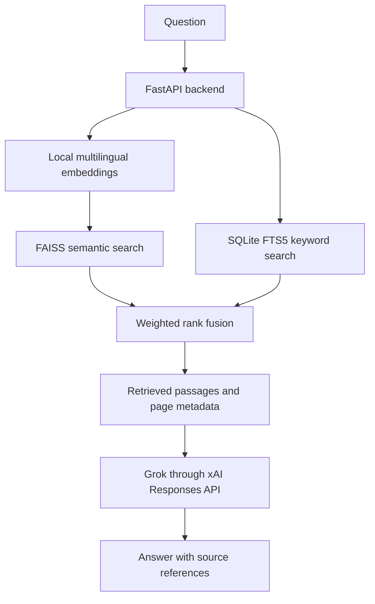

# Customizable Vehicle Manual RAG Assistant

**A customizable RAG assistant for vehicle manuals, powered by Grok.** Configure it for your vehicle by setting its name and indexing its manuals and reference documents.

Ask questions in natural language and get answers grounded in retrieved manual passages, with file and page references.

> Independent project; not affiliated with or endorsed by Hyundai or another vehicle manufacturer. This is a document lookup assistant, not a diagnostic tool. Verify maintenance and safety instructions in the official documentation for your vehicle.

## Customize it for your vehicle

This app runs one vehicle profile and one document collection at a time. To configure it for your vehicle:

1. Copy `.env.example` to `.env` and set `VEHICLE_NAME` to the make, model, and year you want displayed (for example, `2021 Toyota Camry`).
2. Put manuals and reference PDFs for that same vehicle in `data/pdfs/`.
3. Rebuild the local knowledge base with `python scripts/build_index.py`.
4. Start the app. The chat title, API health response, and Grok instructions use the configured vehicle name.

If you change vehicles, replace the PDFs in `data/pdfs/` and rebuild the index so the answers and the vehicle profile stay aligned. Do not combine unrelated vehicles in one knowledge base unless you intentionally want cross-vehicle search.

The repository does not include vehicle manuals, extracted text, vector indexes, or databases. Only add documents you have the right to process. Provide your own authorized manuals locally to populate the knowledge base.

## What it does

- Indexes user-provided PDF manuals and vehicle reference documents.
- Retrieves evidence using multilingual semantic search and BM25 keyword search.
- Sends the question and selected passages to Grok for answer generation.
- Returns source labels with the matching file names, page ranges, and excerpts.
- Supports English and Arabic questions with a multilingual embedding model and language-matched answer instructions.
- Serves a responsive chat interface and JSON API through FastAPI.

## Architecture



### Document ingestion and retrieval

`scripts/build_index.py` reads PDFs from `data/pdfs/`, extracts page text with PyMuPDF, and creates overlapping chunks while retaining source page ranges. Defaults are **380 words per chunk** and **60 words of overlap**. Chunks and metadata are stored in SQLite FTS5; normalized multilingual E5 vectors are stored in a FAISS inner-product index.

For each question, the backend combines semantic search (`intfloat/multilingual-e5-base`) with SQLite FTS5/BM25 keyword search using weighted reciprocal-rank fusion (0.7 semantic / 0.3 keyword). Grok receives the selected excerpts, is told which vehicle profile is configured, must answer only from those excerpts, match the question's language, and cite labels such as `[S1]`.

### Grok and data handling

Grok is called from the backend, so the API key is not exposed in browser code. Requests use the xAI Responses API with `store=False`, and the app does not persist chat history. The question and retrieved passages are still sent to xAI for inference. See [xAI's data storage setting](https://docs.x.ai/developers/model-capabilities/text/generate-text#disable-storing-previous-requestresponse-on-server).

## Run locally on Windows

### Requirements

- Python 3.11
- An xAI API key with API access
- PDF manuals or reference documents you are authorized to process

### Install and configure

From PowerShell in the project directory:

```powershell
py -3.11 -m venv .venv
.\.venv\Scripts\Activate.ps1
python -m pip install --upgrade pip
pip install -r requirements.txt
Copy-Item .env.example .env
notepad .env
```

Set `XAI_API_KEY` and `VEHICLE_NAME` in `.env` to the intended vehicle. Keep `.env` private; it is excluded by `.gitignore`.

### Add PDFs and build the knowledge base

Copy permitted PDFs into `data/pdfs/`, then run:

```powershell
python scripts/build_index.py
```

The first run downloads the embedding model if it is not cached. The generated SQLite database and FAISS index are written under `data/generated/` and excluded from Git.

You can also select another source folder or output location:

```powershell
python scripts/build_index.py --input-dir "C:\Manuals" --db data/generated/kb.db --index data/generated/faiss.index
```

### Start the app

```powershell
uvicorn app.main:app --host 127.0.0.1 --port 8000
```

Open [http://127.0.0.1:8000](http://127.0.0.1:8000). API documentation is at [http://127.0.0.1:8000/docs](http://127.0.0.1:8000/docs).

## API

`POST /api/ask`

```json
{
  "question": "How do I check the engine oil?"
}
```

The response includes an `answer`, a `sources` array with file name, page range, and excerpt, and request timings. `GET /api/health` reports knowledge-base status, model names, and the configured `vehicle_name`.

## Repository layout

```text
app/
  config.py          Environment settings, including VEHICLE_NAME
  embeddings.py      Multilingual E5 encoder
  grok.py            xAI Responses API client and grounded prompt
  main.py            FastAPI endpoints and app startup
  retrieval.py       FAISS + FTS5 hybrid retrieval
  service.py         Retrieval-to-answer orchestration
  static/index.html  Responsive vehicle-aware chat interface
scripts/
  build_index.py     PDF ingestion and local index builder
data/
  pdfs/              Add authorized PDFs here (contents ignored by Git)
  generated/         SQLite and FAISS outputs (ignored by Git)
tests/               Retrieval and API-client helper tests
```

## Tests

```powershell
pytest
```

The tests cover PDF chunk/page mapping, safe FTS query construction, source context formatting, hybrid retrieval, and Grok request settings. A live xAI key and local PDF collection are required to run the full app with real data.

## Limitations

- Scanned PDFs without embedded text need OCR before indexing.
- Answer quality depends on the documents and retrieval results.
- This project does not read vehicle sensors, scan OBD codes, or diagnose faults.
- The question and retrieved excerpts are sent to xAI for model inference. `store=False` disables storing the response for later API retrieval; inference is not local.
- Do not commit manuals, extracted text, vector databases, model files, or API keys. Follow document copyright and usage terms.

## Project status

Personal AI engineering project demonstrating PDF ingestion, hybrid RAG retrieval, grounded generation with Grok, source-aware answers, and a configurable local chat interface.
